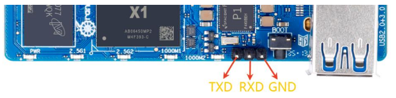

Orange Pi R2S
=============

Orange Pi R2S is a low-cost RISC-V 64-bit platform based on the SpacemiT K1 SoC.

How to Build
============

Clone and enable these repositories and enable the below layers:

* bitbake
* openembedded-core
  * meta
* meta-riscv

See [the Yocto Project](https://docs.yoctoproject.org/brief-yoctoprojectqs/index.html) manual for details.

Set these variables in a configuration file:

* `MACHINE = "orangepi-r2s"`
* `DISTRO = "poky"`
* `EXTRA_IMAGE_FEATURES = "allow-empty-password empty-root-password allow-root-login"`

Build your image:

```
$ bitbake core-image-minimal
```

How the Image Boots
===================

The board as supported here boots as follows:

- ROM loads the bootloader from the internal eMMC boot partition (mmcblk2boot0)
- U-boot tries to read USB (as per its default eMMC-stored environment) first, and then the internal eMMC.
- If the first partition on USB contains boot.scr, that script is loaded.
- The boot.scr script will load the kernel, the devicetree, the initramfs and boot the kernel.

Note: this image does not cover reflashing the eMMC yet.

Flashing the Image
==================

Flash `core-image-minimal-orangepi-r2s.rootfs.wic.gz` onto a USB stick (assuming it's accessed through `/dev/sdx`):

```
$ sudo bmaptool copy build/tmp/deploy/images/orangepi-r2s/core-image-minimal-orangepi-r2s.rootfs.wic.gz /dev/sdx
```

Boot the Board
==============

Insert the USB stick in the USB3 port (top port) of the board.

Connect a USB to serial dongle to your board and to your PC, and
start your favorite terminal emulator:

e.g.:
```
$ sudo apt install picocom
$ picocom -b115200 /dev/ttyUSB0
```



Power the board and you will see it boot to a Linux command line shell.

Resources
=========

* [Orange Pi R2S product page](http://www.orangepi.org/html/hardWare/computerAndMicrocontrollers/details/Orange-Pi-R2S.html)
