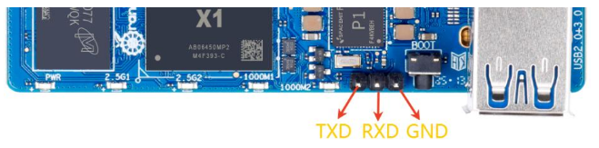

Orange Pi R2S
=============

Orange Pi R2S is a low-cost RISC-V 64-bit platform based on the SpacemiT K1 SoC.

How to Build
============

Clone and enable these repositories and enable the below layers:

* bitbake
* openembedded-core
  * meta
* meta-riscv

See [the Yocto Project](https://docs.yoctoproject.org/brief-yoctoprojectqs/index.html) manual for details.

Set these variables in a configuration file:

* `MACHINE = "orangepi-r2s"`
* `DISTRO = "poky"`
* `EXTRA_IMAGE_FEATURES = "allow-empty-password empty-root-password allow-root-login"`

Build your image:

```
$ bitbake core-image-minimal
```

How to Build - Using Kas
========================

```
$ kas build /path/to/meta-riscv/kas/orangepi-r2s.yml
```

The `kas` tool can be installed as a package on your distribution or
be obtained from the [kas repository](https://github.com/siemens/kas/).

How the Image Boots
===================

The board as supported here boots through the below stages:

```
FSBL.bin -> Mainline U-Boot -> Mainline Linux
            -> Mainline OpenSBI
```

`FSBL.bin` is built from SpacemiT's U-Boot tree, see `recipes-bsp/u-boot/u-boot-spl-spacemit.bb`

It then loads `boot-bundle.itb` to RAM (instead of just `u-boot.itb`), containing:

* `u-boot-nodtb.bin`: mainline U-Boot
* `fw_dynamic.bin`: mainline OpenSBI
* `u-boot.dtb`: U-Boot device tree
* `Image`: mainline Linux kernel
* `k1-orangepi-rv2.dtb`: device tree for Linux

This way, when mainline U-Boot starts, the kernel and its device tree are
already loaded in RAM.

Flashing the Image
==================

We are going to flash the image directly the board eMMC through `fastboot`.

First, install needed packages:

```
sudo apt install fastboot android-sdk-libsparse-utils
```

Then prepare a sparse image `fastboot` can use:

```
gzip -dc core-image-full-cmdline-orangepi-r2s.rootfs.wic.gz > orangepi-r2s.img
img2simg orangepi-r2s.img orangepi-r2s-sparse.img
```

Then, put the board in DFU mode:

* Connect the board USB 2.0 port (white port) to your PC.
  OrangePi docs suggest to use a USB-A to USB-A cable, but that's hard to find.
  Instead, you can use a USB-A to USB-C cable, connecting the USB-C side to your PC,
  and the USB-A side to your board.
* Press and hold the `BOOT` button next to the USB port
* Power up the board using a USB-C cable
* Release the `BOOT` button.

You can then flash the image to the board:
```
fastboot flash emmc orangepi-r2s-sparse.img
``` 

Boot the Board
==============

Connect a USB to serial dongle to your board and to your PC, and
start your favorite terminal emulator:

e.g.:
```
$ sudo apt install picocom
$ picocom -b115200 /dev/ttyUSB0
```



Power the board and you will see it boot to a Linux command line shell.

Resources
=========

* [Orange Pi R2S product page](http://www.orangepi.org/html/hardWare/computerAndMicrocontrollers/details/Orange-Pi-R2S.html)
